# 📘 Manual de Usuario - TwitSnap BackOffice 

<div align="center">
    
</div>

## 📌 Tabla de Contenidos
1. [📖 Introducción](#-introducción)
2. [🛠 Instalación](#-instalación)
3. [🖥️ Uso](#️-uso)
    - [🔑 Inicio de Sesión](#-inicio-de-sesión)
    - [📝 Registro](#-registro)
    - [🏠 Página de Inicio](#-página-de-inicio)
    - [🛠 Servicios](#-servicios)
    - [🚫 Bloquear Usuarios](#-bloquear-usuarios)
    - [✔️ Verificar Usuarios](#-verificar-usuarios)
    - [✍️ TwitSnaps](#️-twitsnaps)
    - [📊 Métricas](#-métricas)

## 📖 Introducción
Este es el manual de usuario para el frontend de la aplicación **TwitSnap BackOffice**. En este manual se describen las funcionalidades y características de la aplicación, así como los pasos necesarios para su instalación y uso.

## 🛠 Instalación
Para instalar la aplicación, se deben seguir los siguientes pasos:
1. **Instalar las dependencias del proyecto:**
    ```bash
    npm install
    ```
2. **Iniciar la aplicación:**
    ```bash
    npm start
    ```

## 🖥️ Uso

### 🔑 Inicio de sesión
Para iniciar sesión en la aplicación, se debe ingresar el correo electrónico y la contraseña en los campos correspondientes y hacer clic en el botón **"Iniciar Sesión"**.

<div align="center">
    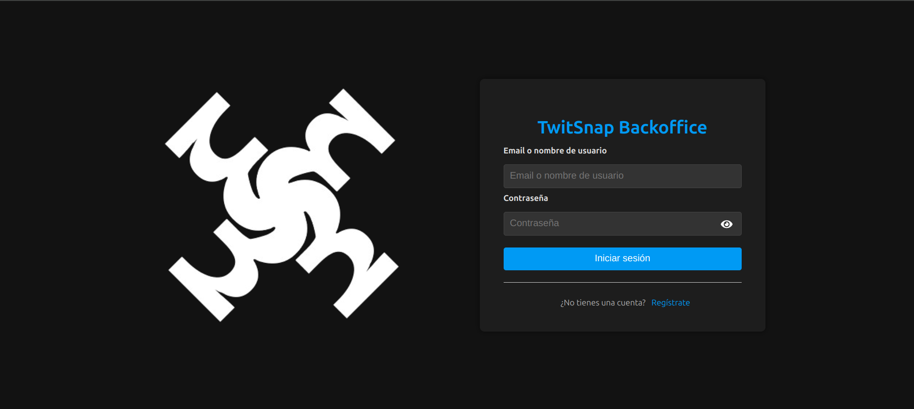
</div>

En caso de ingresar credenciales incorrectas, se mostrará un mensaje de error.

<div align="center">
    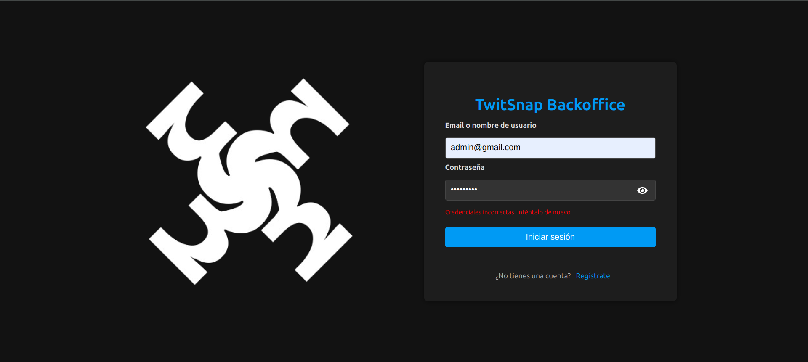
</div>

### 📝 Registro
En caso de no tener una cuenta en la plataforma, el usuario puede registrarse haciendo clic en el enlace **"Registrarse"** en la página de inicio de sesión. Luego, se debe ingresar la información solicitada en el formulario y hacer clic en el botón **"Regístrate"**.

<div align="center">
    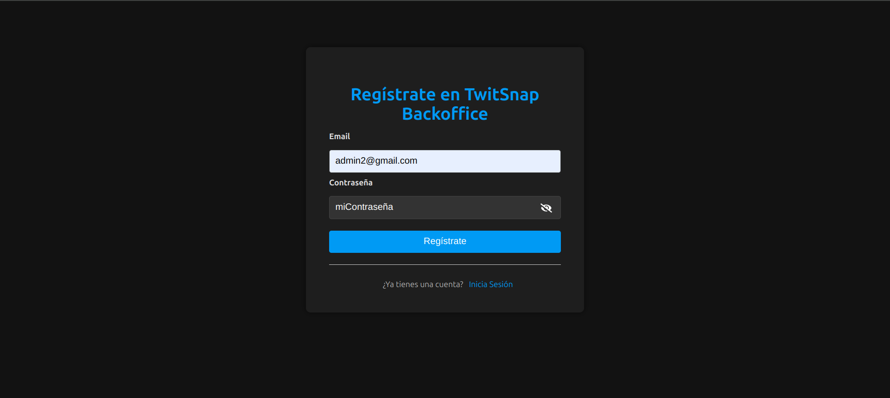
</div>

⚠️ La contraseña debe tener al menos:
- 8 caracteres
- Una letra mayúscula
- Un número
- Un carácter especial

<div align="center">
    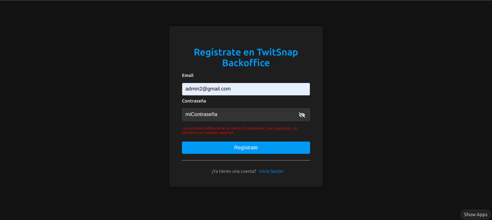
</div>

### 🏠 Página de inicio
Una vez iniciada la sesión, se mostrará la página de inicio de la aplicación. En esta página se puede ver una barra lateral con las opciones de navegación y una sección para ver el perfil.

<div align="center">
    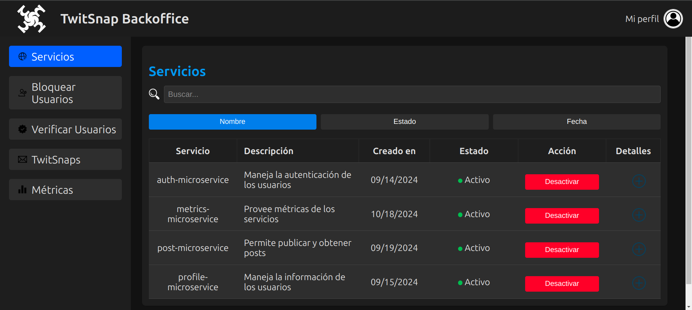
</div>

Al hacer click en el botón **"Mi Perfil"** se mostrará la información del usuario. Además se muestra un botón para cerrar la sesión.

<div align="center">
    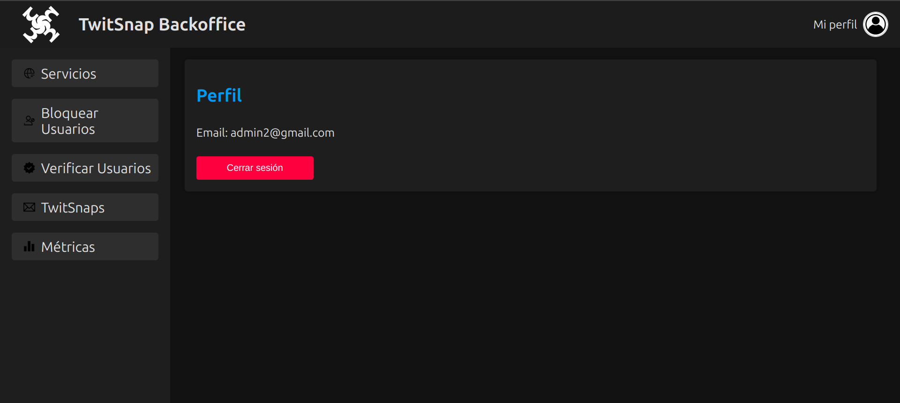
</div>

### 🛠 Servicios
Seleccionando la opción **"Servicios"** en la barra lateral, se mostrará una lista de los servicios disponibles. Para cada servicio se muestra el nombre, la descripción, fecha de creación, estado actual, un botón para bloquear y desbloquear los servicios y un botón para ver más detalles. Además, se puede filtrar la lista de servicios por nombre, estado y fecha de creación.

<div align="center">
    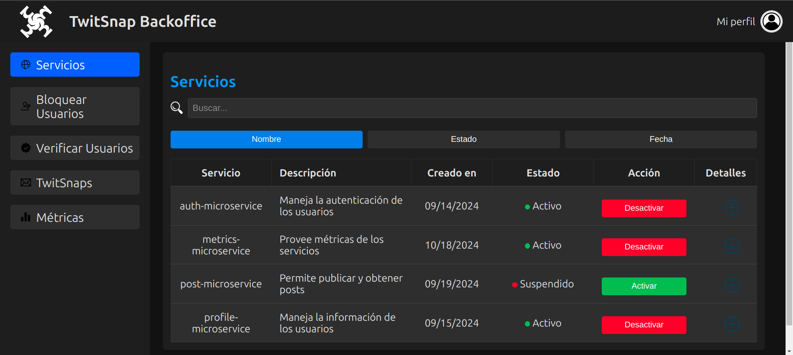
</div>

Al hacer clic en el botón **+** se mostrará una ventana emergente con información adicional sobre el servicio. En esta ventana se puede ver la URL del servicio, el tiempo de ejecución y dos gráficos con el uso de CPU y memoria del servicio.

<div align="center">
    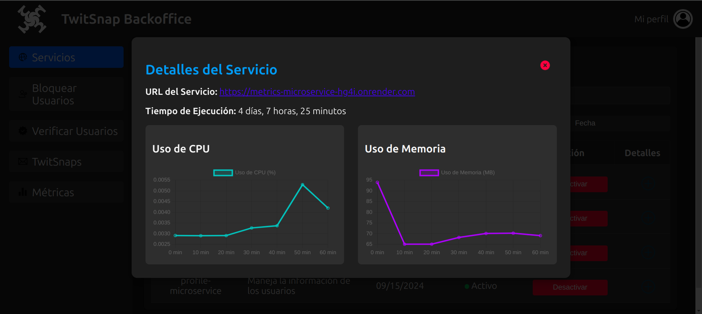
</div>

Para filtrar por nombre se debe colocar la parte del nombre del servicio que se desea ver.

<div align="center">
    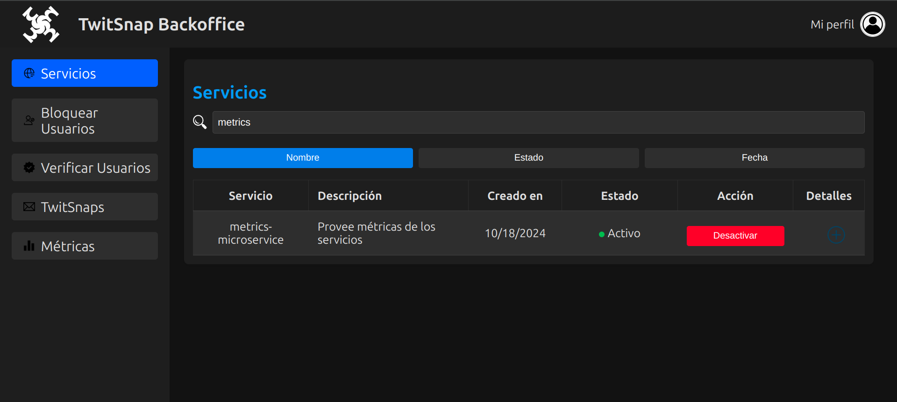
</div>

Para filtrar por estado se debe seleccionar el estado del servicio que se desea ver en el menú desplegable.

<div align="center">
    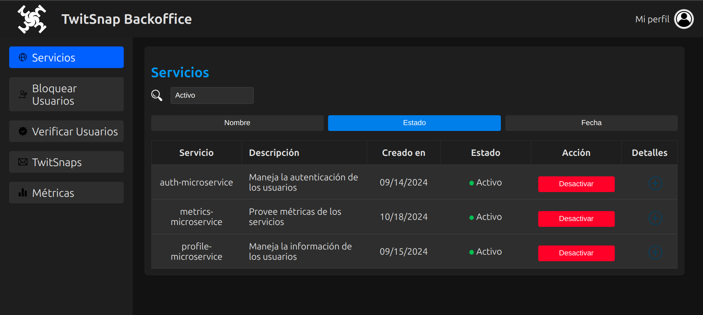
</div>

<div align="center">
    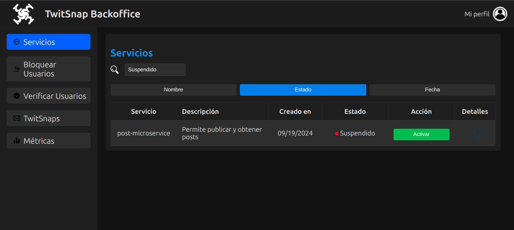
</div>

Para filtrar por fecha de creación se debe seleccionar la fecha de creación del servicio que se desea ver en el menú desplegable.

<div align="center">
    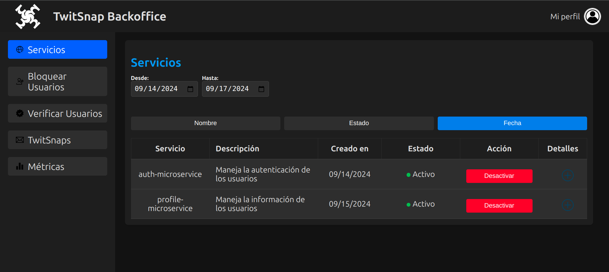
</div>

### 🚫 Bloquear Usuarios
Seleccionando la opción **"Bloquear Usuarios"** en la barra lateral, se mostrará una lista de los usuarios de la plataforma mobile. Para cada usuario se muestra el nombre de usuario, el correo electrónico, el estado del usuario y un botón para bloquear y desbloquear los usuarios y un botón para ver más detalles.

<div align="center">
    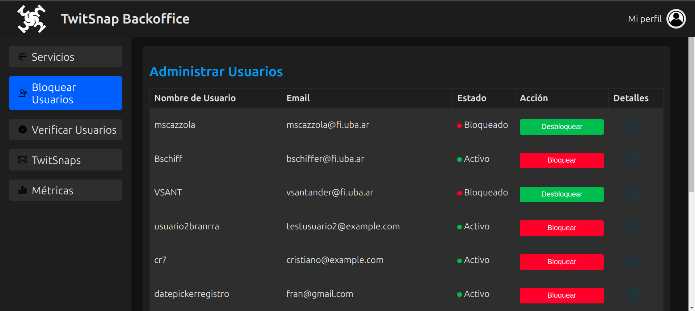
</div>

Al hacer clic en el botón **+** se mostrará una ventana emergente con información adicional sobre el usuario. En esta ventana se pueden ver los detalles del perfil de ese usuario. Se muestra nombre de usuario, correo electrónico, estado, nombre completo, fecha de nacimiento, ubicación e intereses.

<div align="center">
    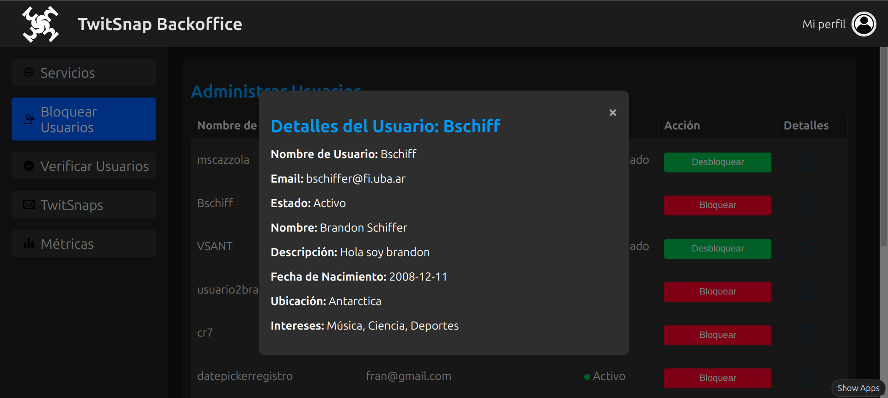
</div>

Al hacer click en el botón **"Bloquear"** se mostrará una pantalla emergente para confirmar la acción. Se debe seleccionar una razón para el bloqueo y una cantidad de días entre 2 y 14. Luego, se debe hacer clic en el botón **"Bloquear"** para confirmar la acción.

<div align="center">
    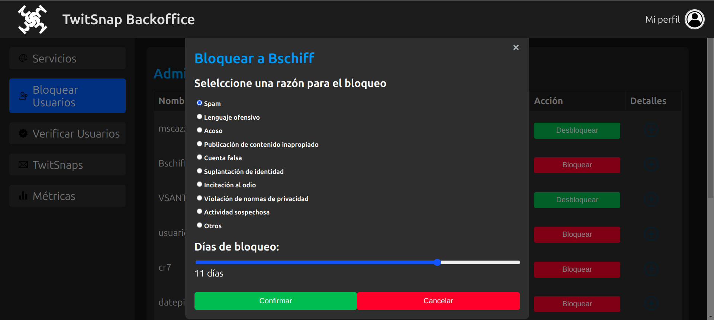
</div>

Una vez que el usuario está bloqueado, se muestra en los detalles del usuario la razón del bloqueo y la cantidad de días que permanecerá bloqueado.

<div align="center">
    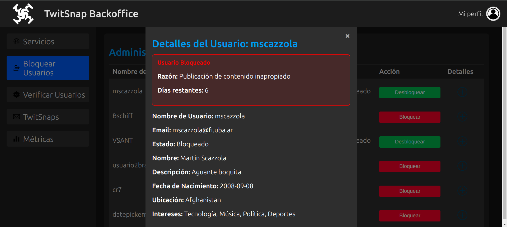
</div>

### ✔️ Verificar Usuarios
Seleccionando la opción **"Verificar Usuarios"** en la barra lateral, se mostrará una lista de los usuarios de la plataforma mobile mostrando su estado de verificación, su nombre de usuario, su apellido y su nombre. Los usuarios verificados aparecen en verde, los no verificados en rojo y los pendientes en naranja.

<div align="center">
    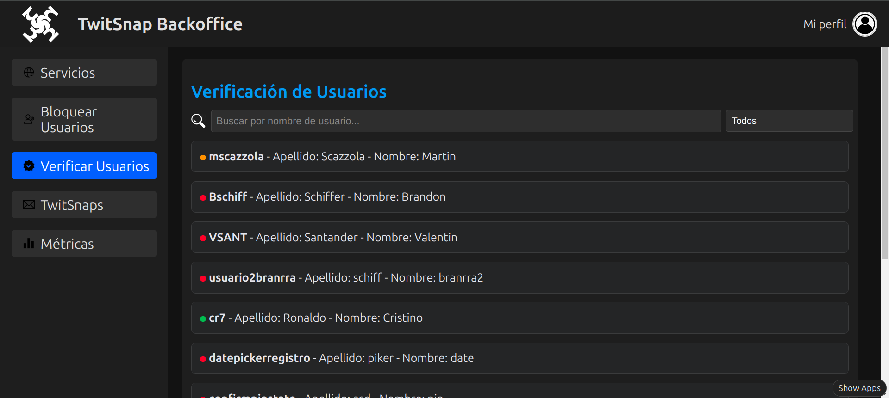
</div>

Haciendo click en cada perfil se abre un menú desplegable con distinta información según el estado de la verificación de cada usuario.

Los usuarios no verificados muestran esta información:

<div align="center">
    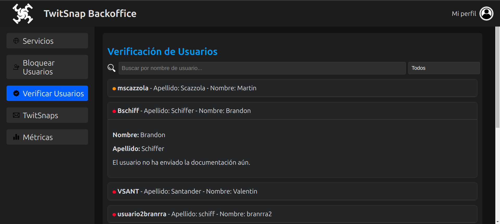
</div>

Los usuarios verificados muestran esta información:

<div align="center">
    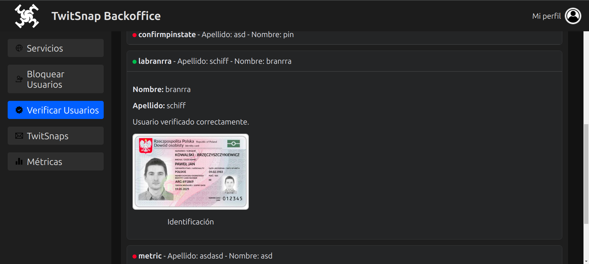
</div>

Haciendo click en la foto se puede ampliar para verla con más detalle.

<div align="center">
    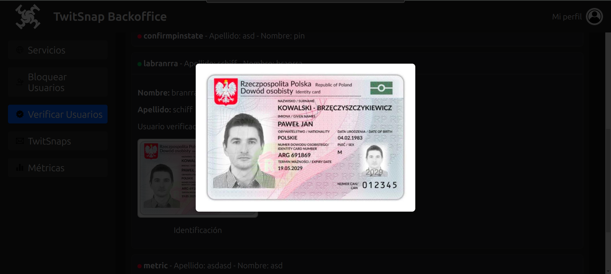
</div>

Los usuarios pendientes muestran esta información:

<div align="center">
    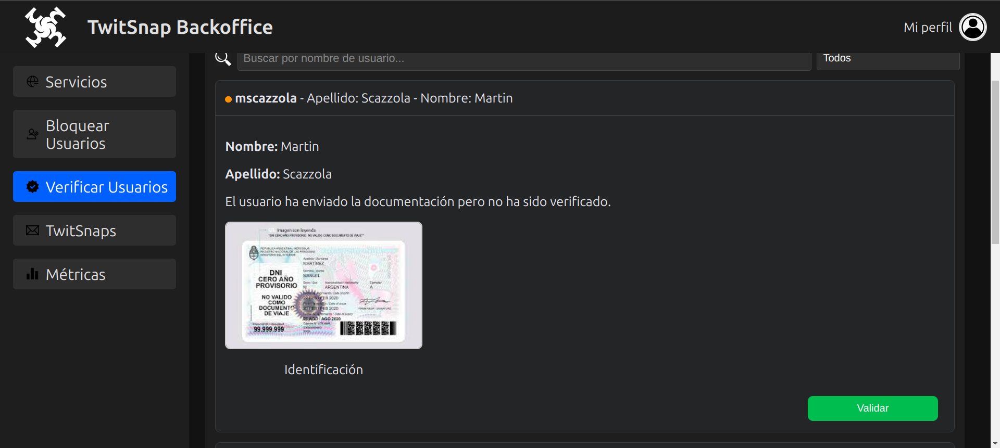
</div>

Al hacer click en **"Validar"** se aprueba la verificación del usuario.

Además se puede filtrar la lista de usuarios por nombre de usuario y estado de verificación.

<div align="center">
    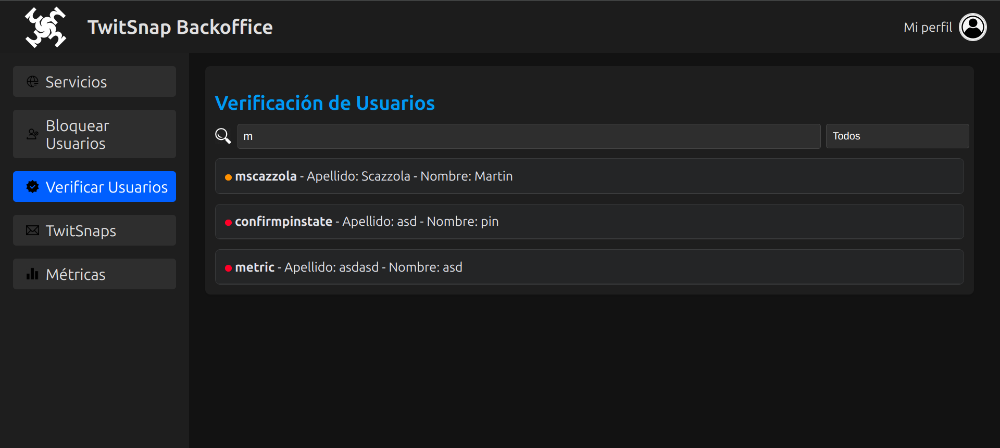
</div>

<div align="center">
    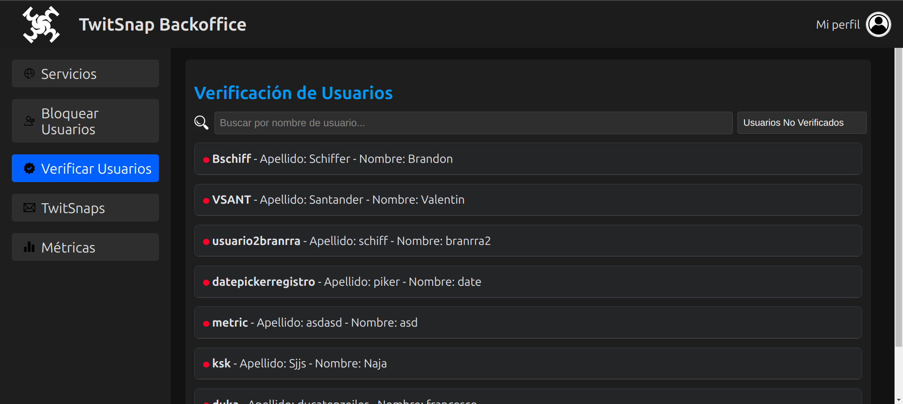
</div>

<div align="center">
    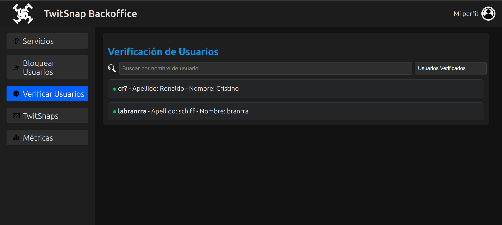
</div>

<div align="center">
    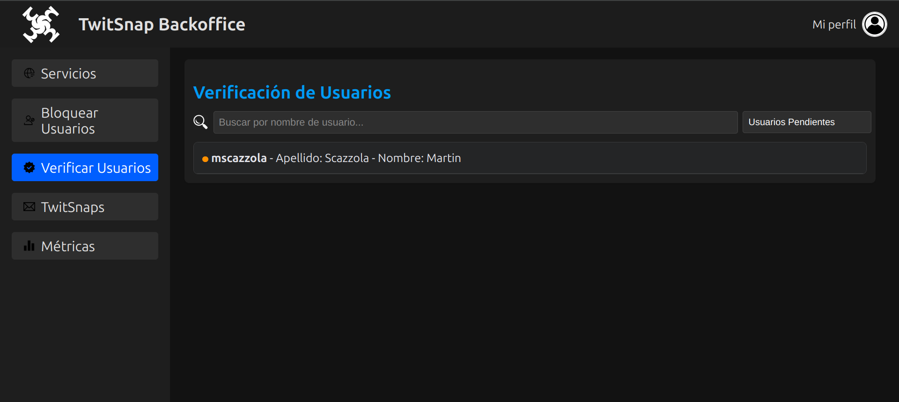
</div>

### ✍️ TwitSnaps
Seleccionando la opción **"TwitSnaps"** en la barra lateral, se mostrará una lista de los TwitSnaps publicados en la plataforma mobile. Para cada TwitSnap se muestra el mensaje, el autor, la fecha de creación del Snap, un botón para bloquear o desbloquear un Snap y un botón para ver más detalles.

Un Snap bloqueado no desaparecerá de la lista de TwitSnaps, pero no podrá ser visualizado por los usuarios de la plataforma mobile. En caso de error o revisión, se puede desbloquear el Snap para que vuelva a estar disponible.

<div align="center">
    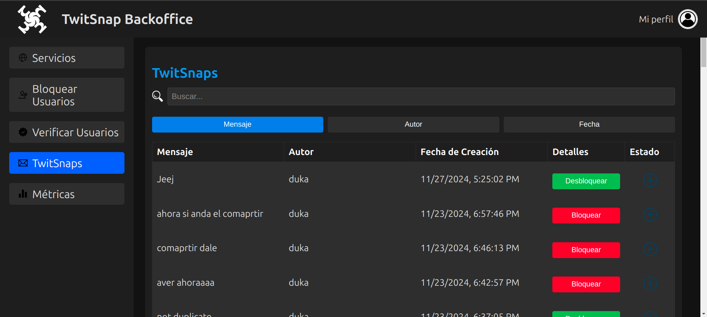
</div>

Al hacer clic en el botón **+** se mostrará una ventana emergente con información adicional sobre el Snap. En esta ventana se puede ver el mensaje del Snap, el autor, el correo electrónico, la cantidad de Likes, la fecha de creación, los hashtags del mensaje (si los tiene) y el estado del Snap.

<div align="center">
    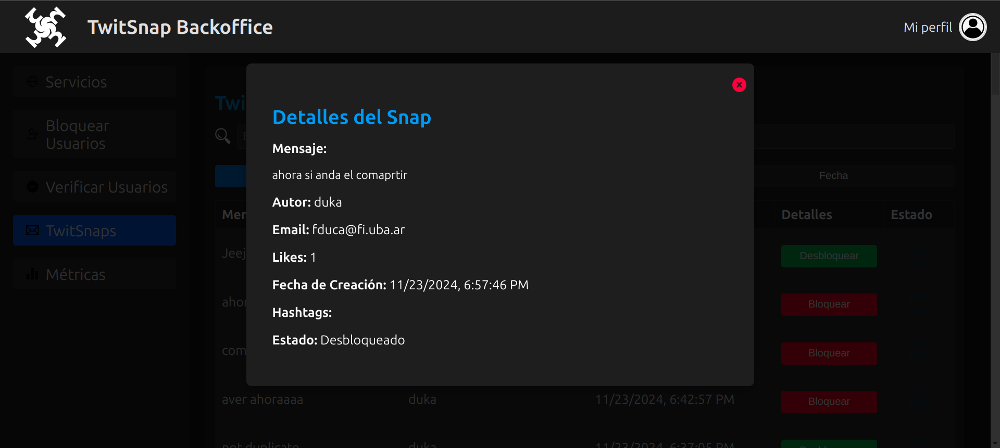
</div>

<div align="center">
    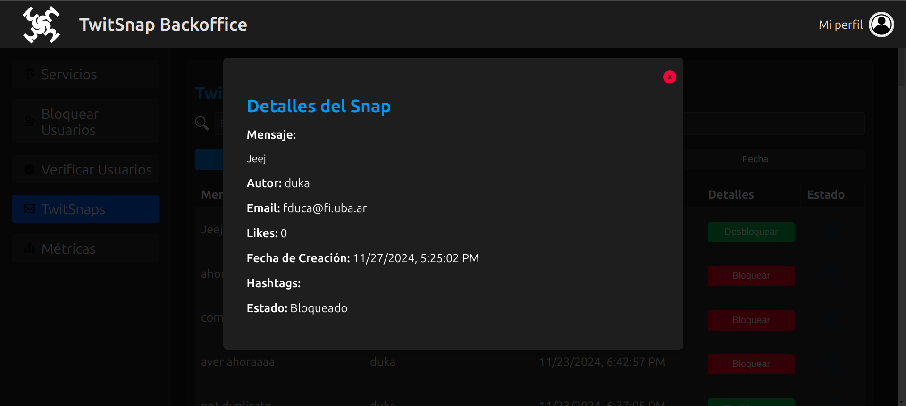
</div>

Se puede filtrar la lista de TwitSnaps por autor, mensaje, fecha de creación y estado.

<div align="center">
    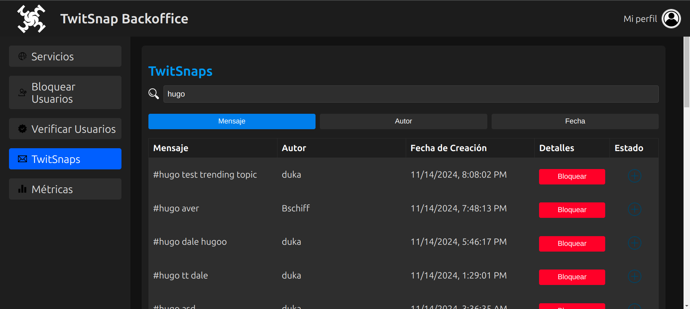
</div>

<div align="center">
    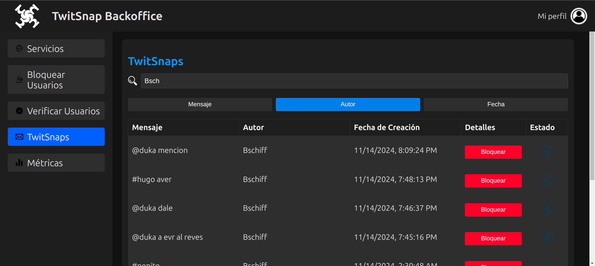
</div>

<div align="center">
    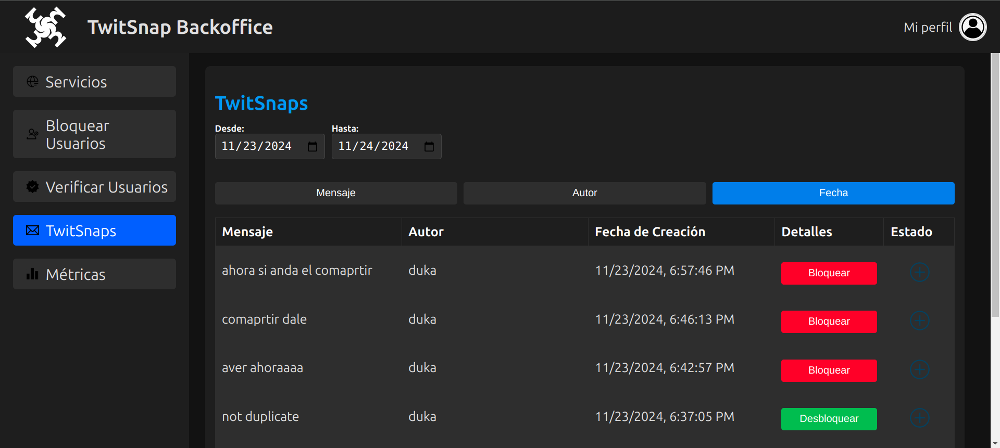
</div>

### 📊 Métricas
Seleccionando la opción **"Métricas"** en la barra lateral, se mostrará una lista de las métricas de la plataforma mobile.

<div align="center">
    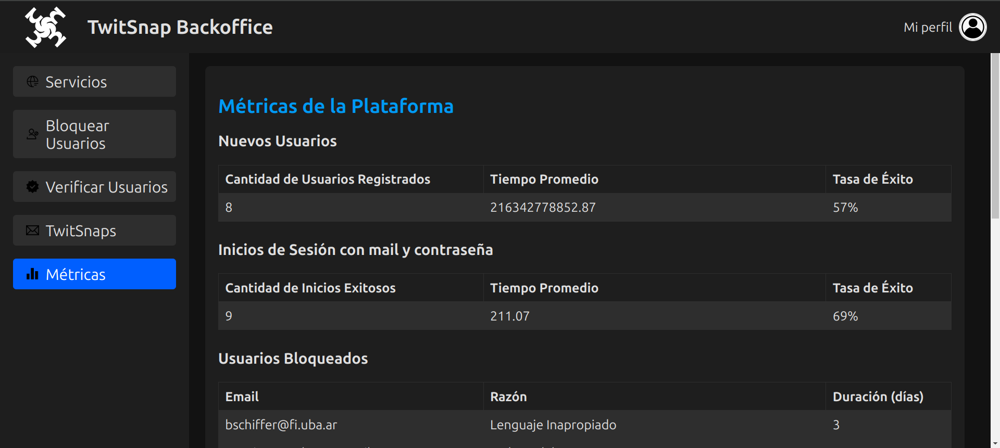
</div>

Hay métricas para los usuarios registrados mostrando cantidad, tiempo promedio y tasa de éxito.

Lo mismo para los inicios de sesión.

<div align="center">
    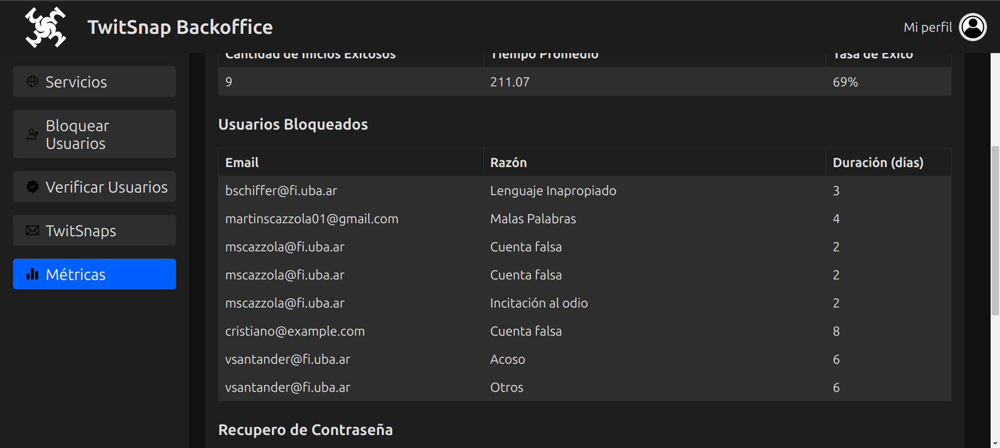
</div>

También hay métricas para los usuarios bloqueados mostrando el correo electrónico, la razón del bloqueo y la cantidad de días.

<div align="center">
    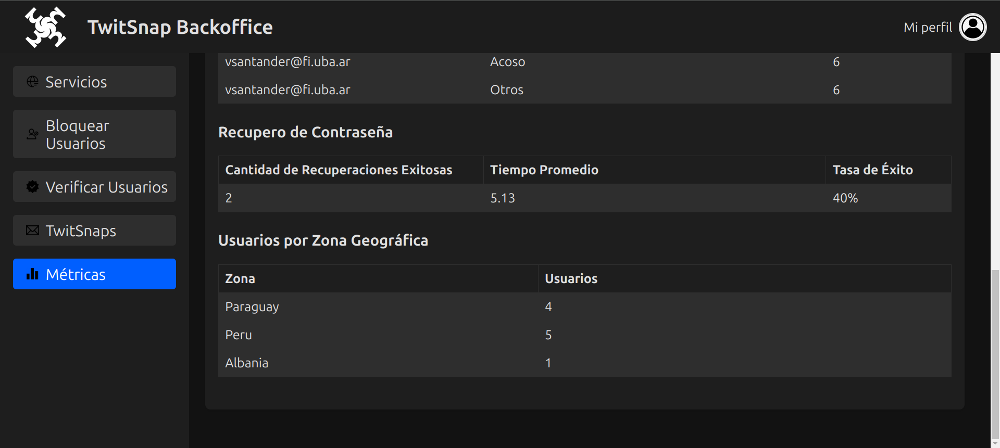
</div>

Finalmente se muestran las métricas de los recuperos de contraseña. Se muestra la cantidad de recuperaciones exitosas, el tiempo promedio y la tasa de éxito.

También se muestran los usuarios por zona geográfica. Se muestra la cantidad de usuarios por país.

<div align="center">
    
</div>